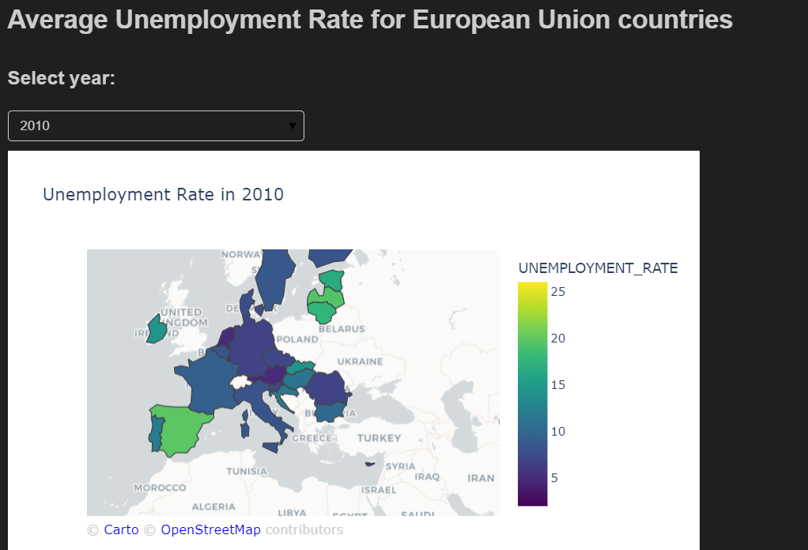
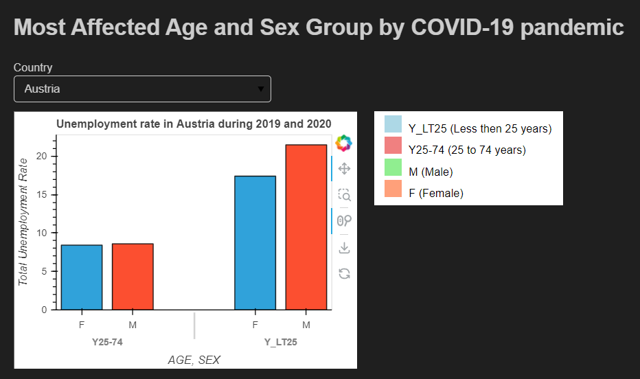
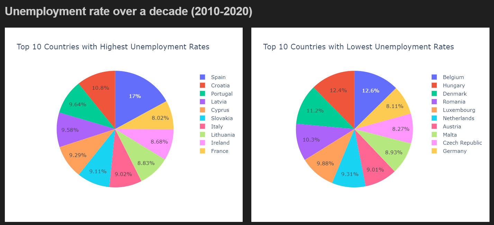
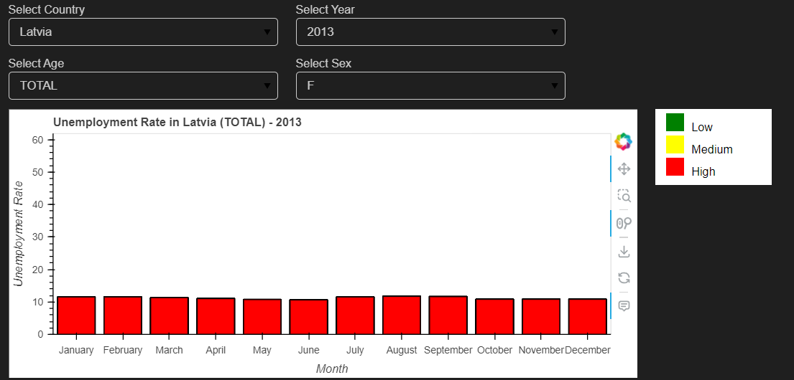

# EU Unemployment Data Analysis
## Overview
This project is developed as part of the "Pre-processing and Visualising Data" course (First Semester of Master's) at the University of Prishtina (UP), Faculty of Electrical and Computer Engineering (FIEK).

This Python script analyzes unemployment data across European Union (EU) countries, focusing on different demographics and spanning from January 2010 to June 2020. The goal is to understand unemployment trends and assess the impact of various factors, including the COVID-19 pandemic.

## Data Sources
`Unemployment Data (une_rt_m.tsv)`
Contains TSV formatted data on unemployment rates in EU countries.

`Country Codes Data (wikipedia-iso-country-codes.csv)`
Includes ISO country codes and related details.

## Dataset Details
Age Groups
- `TOTAL`: All age groups
- `Y_LT25`: Less than 25 years old
- `Y25_74`: Between 25 and 74 years old

Data Units
- `PC_ACT`: Percentage of Active Population
- `THS_PER`: Thousands of Persons

Sex Groups
- `T`: Total (all genders)
- `M`: Male
- `F`: Female

Seasonal Adjustment (s_adj)
- `NSA`: Non-Seasonally Adjusted
- `SA`: Seasonally Adjusted
- `TC`: Trend-Cycle

## Dependencies
- Python 3.x
- Libraries: Pandas, Warnings, Regular Expressions (re), Matplotlib.pyplot (as plt), Scipy.stats, NumPy (as np), Scikit-learn: RandomForestClassifier, accuracy_score, classification_report, confusion_matrix, LabelEncoder, train_test_split, Imbalanced-learn: SMOTE, Seaborn (as sns)  

## Features
- Categorizes data by country, age, unit, sex, and seasonally adjusted rates.
- Compares unemployment rates over time across different EU countries.
- Filters data for EU countries only.

## How to Run
- Ensure Python 3.x and required libraries are installed.
- Place the unemployment data and country codes in the datasets folder.
- Execute the script using Python.

## Analysis Outcomes
- Insights into average unemployment rates by year and country.
- Detailed breakdown of unemployment rates by age, sex, and rate type.

## Requirements

### Phase 1

#### Data Integration
Merge the unemployment dataset with the country codes data.

#### Data Types
- **COUNTRY**: Nominal (Categorical data representing different countries)
- **AGE**: Ordinal (Categorical data with a meaningful order, representing different age groups)
- **SEX**: Nominal (Categorical data representing gender)
- **NUMERIC**: Nominal (Categorical data representing a numeric identifier for each country)
- **ISO**: Nominal (Categorical data representing country codes)
- **MONTH**: Ordinal (Categorical data representing months with a meaningful order)
- **YEAR**: Ordinal (Categorical data representing years with a meaningful order)
- **UNEMPLOYMENT_RATE**: Ratio (Numerical data representing a rate, which includes decimal values)

#### Data Cleaning
The 'unemployment_rate' column contains some dirty data, which is cleaned using the method shown below:

#### Null Values
A small amount of null data is present, and we chose to delete those entries to maintain data integrity. Null values are handled in the above function, where they are denoted with ":".

#### Dimension Reduction
For analysis, only the following columns are considered: ['Country', 'age', 'unit', 'sex', 'C2', 'Numeric', 'Iso', 'Month', 'Year', 'Unemployment_Rate'].

#### Data Transformation
The time series dataset is melted, transforming the 'Date' column and deaggregating it into 'Month' and 'Year' for improved visualization.

### Phase 2

#### Identifying Outliers and Anomalies
Utilized the Z-index method to identify outliers and anomalies, subsequently removing such data.

#### SMOTE Algorithm
Applied the SMOTE algorithm to balance the data after categorizing the 'UNEMPLOYMENT_RATE' column into LOW, MEDIUM, and HIGH.

#### Train and Testing
The dataset is trained for the 'RandomForestClassifier' model. Testing yielded an accuracy of 96%, indicating the model performs well in predicting classes. A 96% accuracy suggests correct predictions for the majority of instances in the test set.

#### Skewed Data
Analysis indicates positive skewness based on mean, median, and mode. The skew() method also confirms this result. While symmetrical data is not necessary for this analysis, we demonstrate the distribution using the log transformation method to visualize how it would appear.

## Statistical Results

| Statistical Measure | Value          |
|----------------------|----------------|
| Count                | 84335.000000   |
| Mean                 | 12.163285      |
| Std                  | 8.881315       |
| Min                  | 1.100000       |
| 25%                  | 6.000000       |
| 50%                  | 9.100000       |
| 75%                  | 15.500000      |
| Max                  | 60.800000      |

### Phase 3

### Visualie average unemployment rate for European Union countries
The visualization is done by using an map to show the average of unemployment rate, based on the year user selects.

### Visualize the affected age and sex groups during COVID-19 pandemic
The visualization is done by using a bar chart to show which group and sex age is most affected based on country selected by the user. But after checking the results for each country we can see the Y_LT25(less than 25 years) are the most affacted in most countries.

### Visualize the countries with highest and lowest unemployment rate during 2010 to 2020
With this pie graph visualization we can see the coutnries with highest and lowest unemployment rate.

### Visualize the bar graph based on user selection. User can select year, country, age and sex.

## Acknowledgements
Data sourced from the EU Open Data Portal: EU Open Data Portal