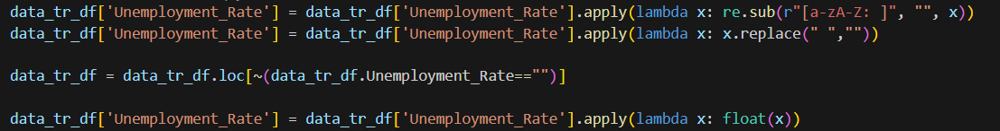

# EU Unemployment Data Analysis
## Overview
This Python script analyzes unemployment data across European Union (EU) countries, focusing on different demographics and spanning from January 2010 to June 2020. The goal is to understand unemployment trends and assess the impact of various factors, including the COVID-19 pandemic.

## Data Sources
`Unemployment Data (une_rt_m.tsv)`
Contains TSV formatted data on unemployment rates in EU countries.

`Country Codes Data (wikipedia-iso-country-codes.csv)`
Includes ISO country codes and related details.

## Dataset Details
Age Groups
- `TOTAL`: All age groups
- `Y_LT25`: Less than 25 years old
- `Y25_74`: Between 25 and 74 years old

Data Units
- `PC_ACT`: Percentage of Active Population
- `THS_PER`: Thousands of Persons

Sex Groups
- `T`: Total (all genders)
- `M`: Male
- `F`: Female

Seasonal Adjustment (s_adj)
- `NSA`: Non-Seasonally Adjusted
- `SA`: Seasonally Adjusted
- `TC`: Trend-Cycle

## Dependencies
- Python 3.x
- Libraries: Pandas, Warnings, Regular Expressions (re)

## Features
- Categorizes data by country, age, unit, sex, and seasonally adjusted rates.
- Compares unemployment rates over time across different EU countries.
- Filters data for EU countries only.

## How to Run
- Ensure Python 3.x and required libraries are installed.
- Place the unemployment data and country codes in the datasets folder.
- Execute the script using Python.

## Analysis Outcomes
- Insights into average unemployment rates by year and country.
- Detailed breakdown of unemployment rates by age, sex, and rate type.

## Requirements
### Phase 1
`Data integration`: Merge the unemployment dataset with the country codes data.
`Data cleaning`: The unemployment_rate colummn has some dirty datas, so we use the below method to clean it.

`Null values`: We have a small amount of data that are null we choose to delete those data and keep the integrity, since it will not effect the analysis result. Null values are managed in the above function, since the null values are written with ":".
`Dimension reduction`: We choose only this columns for analysis ['Country', 'age', 'unit', 'sex', 'C2', 'Numeric', 'Iso', 'Month', 'Year', 'Unemployment_Rate'].
`Data transformation`: Time series dataset is melted. Transformed the 'Date' column and deaggregate it into 'Month' and 'Year' for improved visualization.

### Phase 2
`Identifying outliers and anomalies`: Used the Z-index method to identify outliers and anomalies, and subsequently remove such data.
`SMOTE algorithm`: After categorizing the 'UNEMPLOYMENT_RATE' column into LOW, MEDIUM and HIGH, we apply the SMOTE algorithm to balance the data.
`Train and testing`: The dataset is trained for 'RandomForestClassifier' model and after testing it results that the accurancy of the data is 0.96 (96%), it indicates that the model is performing well in terms of correctly predicting the classes. An accuracy of 96% suggests that the model is making correct predictions for the majority of the instances in the test set.
`Skeweed data`: Based on mean, median and mode we determine that we have positive skewnees. Using the skew() method we get the same result. In this analysis we don't need symetrical data but just to show how it would look, we can use the log transformation method and see the distribution.

## Acknowledgements
Data sourced from the EU Open Data Portal: EU Open Data Portal